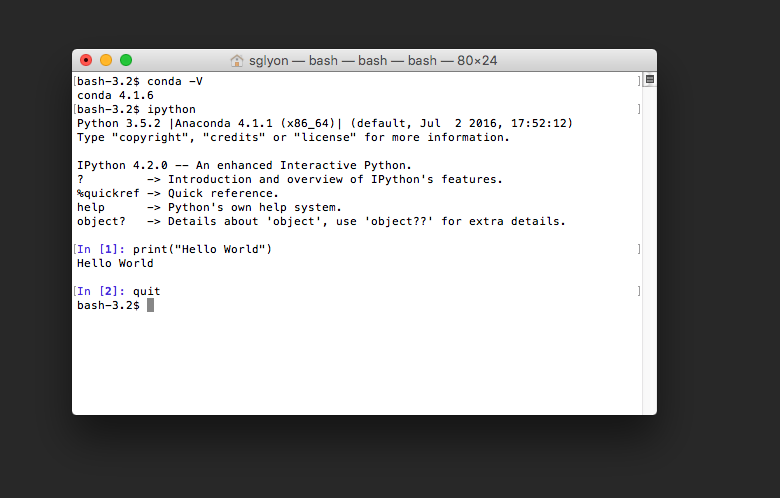
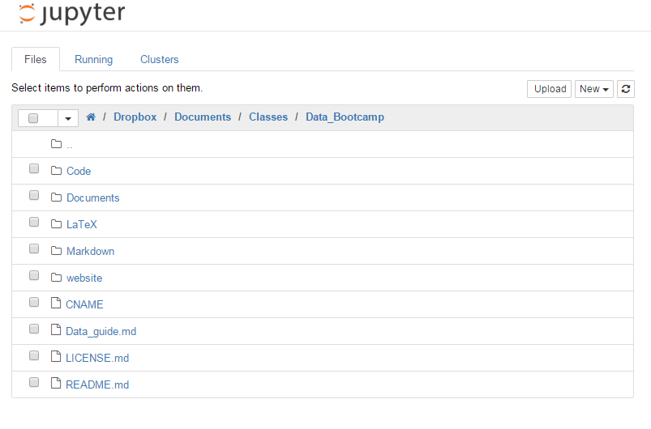

# Installing Python

---
**Overview.** We install Python, then run a test program to make sure it's working.

**Python tools.**  Anaconda distribution, Jupyter.

**Buzzwords.**  Package, distribution, environment, mtwn.

---

Python is a programming language.  Like other computer languages, it comes with an ecosystem of related components. We refer to collections of components as **distributions.** We're going to use a specific distribution -- **Anaconda** -- that comes with lots of components in one user-friendly download.

One kind of component is a user-interface or **environment** for writing and executing code.  Here's an analogy: Word and Google docs are "environments" to produce text documents.  Both work.  We can use either one.  The same is true of Python environments; we use the one we find most convenient.  Think to yourself:  An environment is analogous to Microsoft Word and a Python program is analogous to a Word document.

We'll will focus on one Python environment in this class:

 * **Jupyter** is a browser-based interface for running **Jupyter notebooks**, which combine code, output, and documentation. If you google around, you will see that this is _the_ format in which results are analyzed and communicated by data scientists. For example, here are some notebooks that make this point: [three](http://savvastjortjoglou.com/nba-shot-sharts.html) [more](http://nbviewer.ipython.org/url/jakevdp.github.com/downloads/notebooks/XKCD_plots.ipynb) [examples](https://github.com/NYUDataBootcamp/SQLBootcamp/blob/b048ce3986128941d32bf20731a56c47e17daad0/notebooks/SQL_Intro.ipynb) Get comfortable with it.

**mtwn** In previous version of this course, we used a more traditional  "[IDE](https://en.wikipedia.org/wiki/Integrated_development_environment)" to write and run code. This environment is useful, especially for more involved computations that does not require the presentation and interactivity that Jupyter provides. **Spyder** is the IDE we used and it comes pre-installed with the Anaconda distribution. In future, keep an eye out for [**Jupyter Lab**](https://github.com/jupyterlab/jupyterlab) which is still under development, but combines the best of both worlds (interactive notebook and IDE) in one environment.

This is a lot of jargon to swallow at one time.  Don't panic, it will become familiar with use.  And anything we don't use you can safely ignore.


## Installing Anaconda

Follow these instructions.  By which we mean: **follow these instructions exactly!** Creativity is a wonderful thing, but here it will cost you dearly.

**Step 1. Download the Anaconda installer.**

* Click **[HERE](http://continuum.io/downloads)** or Google "Anaconda downloads."
* Scroll to find "Anaconda for Windows" or further down for "Anaconda for OS X."
* Find the option for **Python 3.6.** **NOT** Python 2.7!  If you get 2.7, you'll have to start over.
* Click the **64-bit Graphical Installer** to start the download.

**Step 2. Run the installer.**  Click on the Anaconda installer you just downloaded to install the Anaconda distribution of Python.  Do what it says...

* For Mac: keep default options and make sure that **it sets Anaconda as your default Python installation!**.
* For Windows: in the box "advanced Installation options", click the box "Add Anaconda to my PATH environment". This option will allow us to call stuff from the command prompt. Again: be sure **it sets Anaconda as your default Python installation!**.

**Step 3. Find and run IPython.**  Look wherever programs are on your computer.

 * Windows: Open the start menu by clicking the start button in the bottom left of your screen or by pressing the windows key. In the search box type "cmd" to open the command prompt. Once you have the command prompt open, type `conda -V`. It should tell you 4.x.y where x and y are just some numbers. Now type `ipython` to open a python session and type `print("Hello World")` and then `quit`

 * Mac: open spotlight either by clicking the magnifying glass in the top right of your screen or pressing command and the space bar at the same time. Type “Terminal” and press enter. Once you have the terminal prompt open, type `conda -V`. It should tell you 4.x.y where x and y are just some numbers. Now type `ipython` to open a python session and type `print("Hello World")` and then `quit`



If these commands worked and displayed something similar (version may be slightly different), you now have Anaconda installed and ready to run.  Congratulations!


## Coding environments

Coding environments are pieces of software we use to write and run code. The best ones make coding easy, even pleasurable, strange as that might sound.  We'll focus on **Jupyter**. We will access this through either the command prompt (Windows) or terminal (Mac) which can be opened as described above. In the steps that follow I will refer to "terminal" -- This is what it is called on a Mac, but, if you are on a Windows machine, please just replace the word terminal with the word command prompt everywhere in this section.

If you still have a terminal open, great. If not, please open a new one (described in Step 3 above)


**Jupyter.**  Jupyter is a graphical environment, which we use to create and run **Jupyter notebooks**. These notebooks combine code, output, words, and graphics.  It's a convenient format for presenting our work to others and can be used as a project report.  

To create or run a Jupyter notebook from the terminal, simply type `jupyter notebook` into the terminal and hit enter.  It will open a tab in your default browser.  (If you're not sure what that is, you'll soon find out.)  In the browser tab, you'll see something like this:




**Exercise.**  Create a directory (folder) on your computer with the name `Data_Bootcamp` and store your programs there.  If you're not sure how to do this, let us know.  (And note well:  There is an **underscore** `"_"` between "Data" and "Bootcamp", not a blank space.)


## Run test programs

Let's run a test program  and make sure everything works.

First, start the Jupyter notebook from the terminal.  (If you're not sure what this means, go back to the previous section.) Once you have it up and running:

* Choose the directory. You should see the directory structure of your computer in Jupyter.  Navigate to the `Data_Bootcamp` directory (folder) you created earlier.

* Create a Jupyter notebook.  Click on the "New" dropdown menu in the upper right corner and choose Python 3.  This will create a blank notebook and an empty cell, where you can enter words or code.

* Set the file name.  To the right of the word Jupyter at the top, you'll see "Untitled".  Change it to `bootcamp_test`.

* Enter code.  Click on the dropdown menu below the word "Help" and choose Code.  Then enter the code following code in the empty cell.

```python
import sys      # import system module (don't ask)

print('\nWhat version of Python?\n', sys.version, '\n', sep='')

if float(sys.version_info[0]) < 3.0:
    raise Exception('Program halted, old version of Python. \n',
                     'Sorry, you need to install Anaconda again.')
else:
    print('Congratulations, you have Python 3!')
```

[If you're feeling lazy, you can make do with the first two lines on their own, but you won't get the messages we describe below.]

* Run the code.  Click on "Cell" at the top and choose Run All.

Output will appear in the same cell below your code.  If it says "Congratulations etc." you're all set. Pat yourself on the back and buy yourself a cold drink, you've earned it. If you get the message "Program halted, old version of Python, etc," you need to go back and install Anaconda again, this time **following the instructions exactly**! Yes, we know that's discouraging, but it's better to know that now than run into problems later. Have a cold drink anyway and catch your breath.

**Comment (mtwn).** We use the acronym **mtwn** to indicate material that is "more than we need," meaning it's safe to ignore.  One of the challenges of learning to code is the overwhelming quantity of information.  If you think you've exceeded your bandwidth, skip anything labeled mtwn.

**More comments.** All of these are mtwn, but we thought they would make the code we just entered less mysterious -- and give us a head start with Python programming.  (i) Anything following a hash (#) is a comment and has no effect on what the program does.  (ii) Blank lines are optional, but they make the code easier to read.  (iii) The rest of the code checks the Python version (`sys.version_info`).  If the version is less than 3.0, it prints an error message (`raise Exception`).  Otherwise it prints the message "Congratulations, etc."  (iv) The statements that begin with `raise` and `print` are indented exactly four spaces.  That's a standard feature of Python.  Anything else generates an error.

## Let's go!

We're now ready to write and run Python programs. Take a bow.


## Review

**Exercise.** What version of Python are we using?

**Exercise.** Explain to your friend (or yourself) what a Jupyter Notebook is.

**Exercise.** Where is your ``Data_Bootcamp`` folder?


## Resources

More on the Anaconda distribution and its contents:

* Anaconda [download page](http://continuum.io/downloads) and [package list](http://docs.continuum.io/anaconda/pkg-docs).
* IPython [documentation](http://ipython.org/notebook.html).  Look for the [Pybonacci demo](https://youtu.be/H6dLGQw9yFQ), it covers the basics in 5 minutes.  You can also get help in Jupyter:  click on "Help" at the top and choose "User Interface Tour."
* [Links](https://www.reddit.com/r/Python/comments/2trvyy/resource_or_tutorials_for_anacondaconda/) to other documentation and support.  More than you'll ever want or need.
